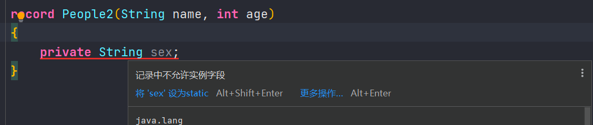
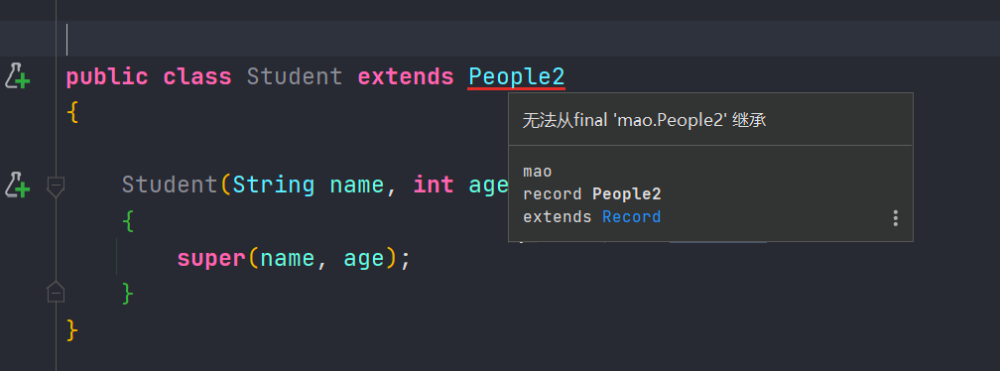

## Records记录类型

### 概述

通过record增强Java编程语言。record提供了一种紧凑的语法来声明类，这些类是浅层不可变数据的透明持有者

我们经常听到这样的抱怨：“Java太冗长”、“Java规则过多”。首当其冲的就是充当简单集合的“数据载体”的类。为了写一个数据类，开发人员必须编写许多低价值、重复且容易出错的代码：构造函数、访问器、equals()、hashCode()和toString()等等。

尽管IDE可以帮助开发人员编写数据载体类的绝大多数编码，但是这些代码仍然冗长。

record是Java的一种新的类型。同枚举一样，record也是对类的一种限制。record放弃了类通常享有的特性：将API和表示解耦。但是作为回报，record使数据类变得非常简洁。


### 以前的写法


```java
package mao;

/**
 * Project name(项目名称)：JDK_14_Records
 * Package(包名): mao
 * Class(类名): People
 * Author(作者）: mao
 * Author QQ：1296193245
 * GitHub：https://github.com/maomao124/
 * Date(创建日期)： 2023/11/9
 * Time(创建时间)： 17:27
 * Version(版本): 1.0
 * Description(描述)： 无
 */

public class People
{
    private String name;
    private int age;

    public People(String name, int age)
    {
        this.name = name;
        this.age = age;
    }

    public String getName()
    {
        return name;
    }

    public int getAge()
    {
        return age;
    }

    @Override
    public boolean equals(Object o)
    {
        if (this == o) return true;
        if (o == null || getClass() != o.getClass()) return false;

        People people = (People) o;

        if (getAge() != people.getAge()) return false;
        return getName() != null ? getName().equals(people.getName()) : people.getName() == null;
    }

    @Override
    public int hashCode()
    {
        int result = getName() != null ? getName().hashCode() : 0;
        result = 31 * result + getAge();
        return result;
    }

    @Override
    public String toString()
    {
        return "People{" +
                "name='" + name + '\'' +
                ", age=" + age +
                '}';
    }
}
```


特点：

* 没有无参构造方法，需要初始化时对成员变量赋值
* 成员变量只有 getter 方法
* 覆写了 超类 Object 的 equals 、hashCode、toString 方法


从表面上看，将Record是为了简化模板编码而生的，但是它还有“远大”的目标：modeling data as data（将数据建模为数据）。record应该更简单、简洁、数据不可变。


### 现在的写法

```java
package mao;

record People2(String name, int age)
{

}
```


因为record在语义上是数据的简单透明持有者，所以记录会自动获取很多标准成员：

- 状态声明中的每个成员，都有一个 private final的字段；
- 状态声明中的每个组件的公共读取访问方法，该方法和组件具有相同的名字；
- 一个公共的构造函数，其签名与状态声明相同；
- equals和hashCode的实现；
- toString的实现。


使用：

```java
package mao;

/**
 * Project name(项目名称)：JDK_14_Records
 * Package(包名): mao
 * Class(类名): Test1
 * Author(作者）: mao
 * Author QQ：1296193245
 * GitHub：https://github.com/maomao124/
 * Date(创建日期)： 2023/11/9
 * Time(创建时间)： 17:26
 * Version(版本): 1.0
 * Description(描述)： 无
 */

public class Test1
{
    public static void main(String[] args)
    {
        People2 people2 = new People2("张三",17);
        System.out.println(people2);
        System.out.println(people2.name());
        System.out.println(people2.age());
        System.out.println(people2.hashCode());
        System.out.println(people2.equals(new People2("张三",18)));
        System.out.println(people2.equals(new People2("张三2",17)));
        System.out.println(people2.equals(new People2("张三",17)));
    }
}
```


```sh
People2[name=张三, age=17]
张三
17
24021576
false
false
true
```


### 限制

* records不能扩展任何类，并且不能声明私有字段以外的实例字段。声明的任何其他字段都必须是静态的
* records类都是隐含的final类，并且不能是抽象类。这些限制使得records的API仅由其状态描述定义，并且以后不能被其他类实现或继承








### 在record中额外声明变量

也可以显式声明从状态描述自动派生的任何成员。可以在没有正式参数列表的情况下声明构造函数（这种情况下，假定与状态描述相同），并且在正常构造函数主体正常完成时调用隐式初始化（this.x=x）。这样就可以在显式构造函数中仅执行其参数的验证等逻辑，并省略字段的初始化，例如：


```java
package mao;

record People3(String name, int age)
{
    public People3
    {
        System.out.println(name);
        System.out.println(age);
    }
}
```


```java
package mao;

/**
 * Project name(项目名称)：JDK_14_Records
 * Package(包名): mao
 * Class(类名): Test2
 * Author(作者）: mao
 * Author QQ：1296193245
 * GitHub：https://github.com/maomao124/
 * Date(创建日期)： 2023/11/9
 * Time(创建时间)： 17:41
 * Version(版本): 1.0
 * Description(描述)： 无
 */

public class Test2
{
    public static void main(String[] args)
    {
        People3 people3 = new People3("张三", 29);
    }
}
```


```sh
张三
29
```


